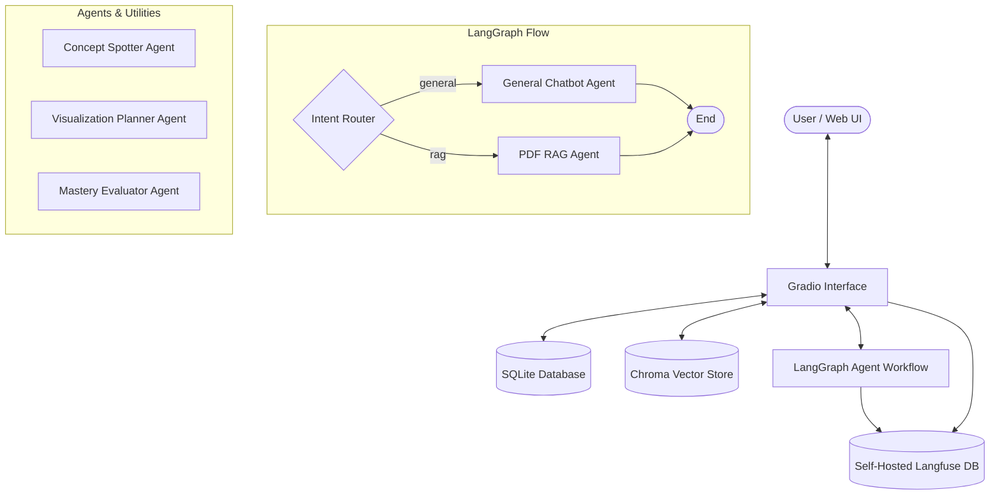

# Paper Helper & Visual Study Companion (DDM501 Lab 3 & 4)

A local-first, multi-agent conversational AI assistant and visual study companion. It transforms text-based PDFs into interactive learning networks. It is built in Python using **LangGraph**, **LangChain**, **Gradio**, **SQLite**, and **Chroma** (vector database), with **Langfuse** for LLM observability.

---

## System Architecture



### Components

1. **Intent Router**: Uses a structured LLM call (Pydantic schema validation) to analyze the query. Routes corporate policy/PDF queries to the **RAG Agent**, and greetings/general logic to the **General Agent**. Has a robust regex-based local fallback if offline.
2. **General Chatbot Agent**: A conversational agent acting as a helpful assistant.
3. **RAG Agent**: Retrieves context from Chroma Vector Store and answers queries **strictly grounded** in the document, citing page numbers (e.g., `[Page 3]`).
4. **Concept Graph Builder**: Processes new documents to extract 6-15 main concepts and relationships to construct an interactive **Knowledge Graph** network.
5. **Visualization Planner**: Selects and compiles structured visualization specs (Plotly graphs, KaTeX step-by-step formulas, or Canvas sequence diagrams).
6. **Mastery Evaluator Agent**: Evaluates written student answers against reference concepts and updates four-axis mastery scores (Memory, Comprehension, Structure, Application) using a **monotone clamp** rule (scores never decrease).
7. **Langfuse Integration**: Native `CallbackHandler` tracking traces, nested spans (nodes), latency, token costs, and interactive thumbs-up/down feedback ratings.

---

## Setup & Ingestion

### Prerequisites
- Python 3.10+ (Anaconda / Miniconda recommended)
- Docker & Docker Compose (for Langfuse Observability)

### Installation
1. Install the dependencies listed in `requirements.txt`:
   ```bash
   pip install -r requirements.txt
   ```
2. Create your `.env` configuration file from `.env.template` (or write it directly):
   ```env
   OPENAI_API_KEY=your-openai-api-key
   LANGFUSE_PUBLIC_KEY=pk-lf-your-local-public-key
   LANGFUSE_SECRET_KEY=sk-lf-your-local-secret-key
   LANGFUSE_HOST=http://localhost:3000
   ```

### Docker Observability (Lab 4)
Spin up the self-hosted local Langfuse web server and Postgres database:
```bash
docker-compose up -d
```
Access the dashboard at `http://localhost:3000`, click **Sign Up** to create an admin account, generate your API Credentials, and paste them into your `.env` file.

---

## Running the Application

Start the local server entrypoint:
```bash
python main.py
```
Open the provided web interface URL (usually `http://127.0.0.1:7860`) in your browser.

---

## Running Automated Tests

Run the full automated test suite using `pytest`:
```bash
pytest
```
This runs the 6 semantic routing tests in `tests/test_routing.py` and the 6 observability and clamping calculation tests in `tests/test_observability.py`.

---

## Sample Query logs & State Changes

### Example 1: Route Intent Classification (General Agent)
- **User Query**: `"Hello! What are you?"`
- **LangGraph Router Action**: Evaluates query and returns `route="general"`.
- **General Agent Response**: `"Hello! I am the Paper Helper assistant. I can help answer questions about your document, map concepts, or visualize mathematical formulas. How can I assist you today?"`

### Example 2: Scoped RAG Grounded Answer (RAG Agent)
- **User Query**: `"What is the reimbursement limit for meals during corporate travel?"`
- **LangGraph Router Action**: Evaluates query and returns `route="rag"`.
- **Retrieval Context**: Retrieves chunk: `"...meal allowance: employees are reimbursed up to a maximum of $150 per day for meals. Receipts are required for all individual meal charges exceeding $25..."` from `data/company_policies.txt`.
- **RAG Agent Response**: `"According to the corporate travel policy, you can receive up to a maximum of $150 per day for meals. Receipts are required if an individual meal charge exceeds $25 [Page 1]."`

### Example 3: RAG Hallucination Guard
- **User Query**: `"Can I get reimbursed for dental cleanings under the travel policy?"`
- **LangGraph Router Action**: Evaluates query and returns `route="rag"`.
- **RAG Agent Response**: `"I am sorry, but the provided document does not contain that information."` (Grounded in context, avoiding hallucinations).
