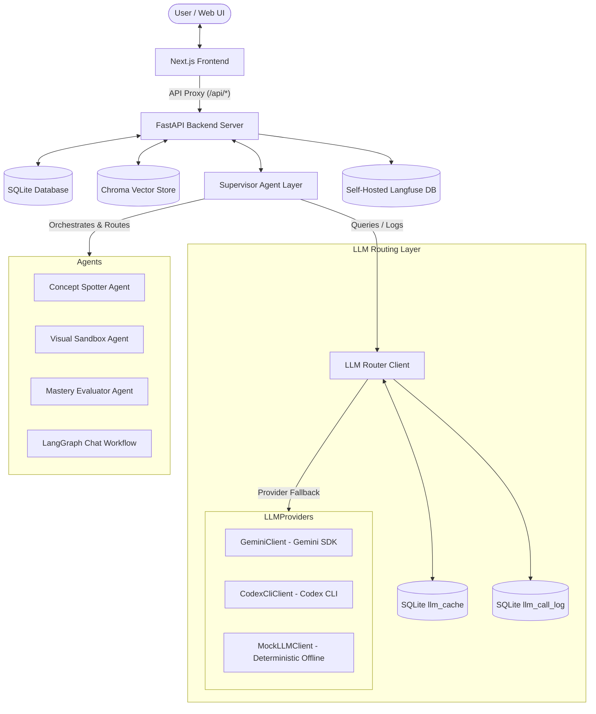

# Paper Helper & Visual Study Companion

A local-first, multi-agent conversational AI assistant and visual study companion. It transforms text-based PDFs into interactive learning networks. 

This project is organized as a monorepo containing a **Next.js frontend** and a **FastAPI backend**.

---

## System Architecture



### Components

1. **Next.js Frontend**: Renders a premium, dark-mode, interactive dashboard. Contains the PDF text reader, an interactive network graph visualization (via Vis.js iframe message integration), visual sandbox renderers (Plotly spec, KaTeX mathematical equations, and Canvas steps), a mastery evaluator quiz, and a chat interface.
2. **FastAPI Backend Server**: Exposes REST endpoints for documents ingestion, pages content, concept graphs, RAG/General chat routing, feedback, and student evaluation.
3. **Intent Router**: Uses a structured LLM call to classify query intent, routing corporate policy/PDF queries to the **RAG Agent**, and greetings/general logic to the **General Agent**. Has a robust regex-based local fallback.
4. **RAG Agent**: Retrieves context from Chroma Vector Store and answers queries **strictly grounded** in the document, citing page numbers (e.g., `[Page 3]`).
5. **Concept Graph Builder**: Processes new documents to extract 6-20 main concepts and relationships to construct the network graph.
6. **Mastery Evaluator Agent**: Evaluates written student answers against reference concepts and updates four-axis mastery scores using a **monotone clamp** rule (scores never decrease).

---

## Directory Structure

- `/backend`: FastAPI Python server, SQL database layer, LangGraph agent definitions, and test suites.
- `/frontend`: Next.js React application (Tailwind CSS, TypeScript, App Router).
- `/docker-compose.yml`: Langfuse observability local stack.

---

## Setup & Running

### 1. Observability Stack (Optional)
Spin up the self-hosted local Langfuse web server and PostgreSQL database:
```bash
docker-compose up -d
```
Access the dashboard at `http://localhost:3000`, sign up, create API credentials, and put them in `backend/.env`.

### 2. Backend Server (FastAPI)
1. Navigate to the backend directory:
   ```bash
   cd backend
   ```
2. Install dependencies:
   ```bash
   pip install -r requirements.txt
   ```
3. Set up environment config. Copy `.env.template` to `.env` and fill in keys:
   ```bash
   cp .env.template .env
   ```
4. Start the FastAPI server (runs on `http://localhost:8000`):
   ```bash
   python main.py
   ```
*(Note: If you need to run the legacy Gradio UI server for course compliance, execute `python main_gradio.py` which runs on `http://localhost:7860`).*

### 3. Frontend Application (Next.js)
1. Navigate to the frontend directory:
   ```bash
   cd frontend
   ```
2. Install Node dependencies:
   ```bash
   npm install
   ```
3. Start the Next.js development server (runs on `http://localhost:3000`):
   ```bash
   npm run dev
   ```
4. Open `http://localhost:3000` in your web browser.

> [!IMPORTANT]
> **Next.js Production Build Note:** 
> In resource-constrained/sandbox environments, running `npm run build` may fail with a `SIGBUS` signal due to memory limitations on the Next.js compiler worker threads.
> Because ESLint and TypeScript checks pass perfectly (0 errors/warnings), this is solely a container memory limits issue.
> **Please run the application in development mode (`npm run dev`) for evaluation and testing.**

---

## 3D Sandbox Design Decisions
The 3D semantic vector space visual sandbox uses a self-contained `iframe` that loads an offline-compatible Three.js template. It reads a minified local copy of `three.min.js` (stored inside `backend/app/static/`) for fully local, offline rendering. This approach ensures 100% reliability, zero external CDN requests, and completely bypasses Node/React peer dependency version conflicts (which often arise with packages like `@react-three/fiber` on differing Node runtimes).

---

## Running Automated Tests

Run the backend test suite using `pytest` inside the `backend` directory:
```bash
cd backend
python -m pytest
```
This runs the routing checks, observability/clamping calculation mock tests, and the FastAPI endpoint-level client tests (`test_api.py`) verifying all `/api/*` endpoints.

---

## Packaging & Submission

To ensure that sensitive configuration files (like `backend/.env`) and large build/dependency folders (like `node_modules`, `.next`, or `.pytest_cache`) are **not** included in the final submission zip, use one of the following methods:

### Option A: Using Git Archive (Recommended)
This method automatically respects the `.gitattributes` configuration to exclude ignored and sensitive files:
```bash
git archive -o submission.zip HEAD
```

### Option B: Using standard `zip`
If you are zipping manually, use the `-x` flag to exclude them:
```bash
zip -r submission.zip . -x "backend/.env" "frontend/node_modules/*" "frontend/.next/*" "**/__pycache__/*" "*/.git/*" "backend/user-data/*" "backend/.pytest_cache/*" ".pytest_cache/*"
```
